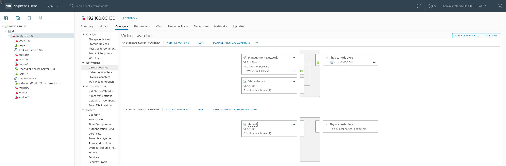
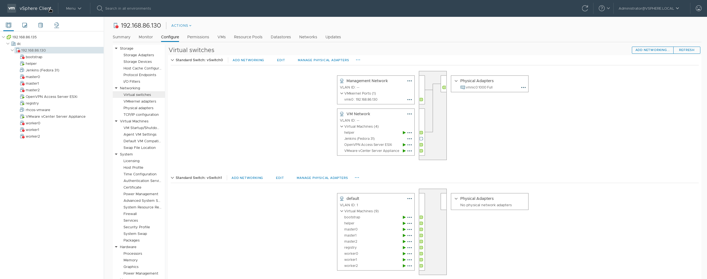

# Installation in a Restricted Network 

Installation in an restricted (network) environment is going to be different. In such a setting, the base cluster (bootstrap, masters[0,3], workers[0,3]) won't have open access to the internet. The only access this core infrastucture will be allowed to have, is to a registry on a node/VM that will mirror the contents of the installation repos hosted on quay.io. 

This documentation will guide you in using this repo to setup this registry for installation in such as restricted network.

## Prerequisites
0. Familiarity with this repo and a thorough reading of [README](README.md) 
1. Prepare a RHEL 8/Fedora VM or reuse `helper` node as registry host
   * Run `yum install -y podman httpd httpd-tools` when the VM is connected to internet
2. The `helper` is the `bastion` host and as such the installation msut be run on the `helper`

## (Optional) Network isolation for OpenShift VMs + registry in vCenter
> This section is meant for a lab environment, to practice a disconnected install. The subnets and IP addresses used below are shown only as an illustration.

### [Step 1] Create a Standard Network Port Group
1. Right click on vSphere host 🠪 Configure 🠪 Networking 🠪 Virtual Switches 
2. Click on `ADD NETWORKING` button on the page (top right hand corner)
3. Select `Virtual Machine Port Group for a Standard Switch` and click `NEXT`
4. Select `New standard switch` (with defaults) and click `NEXT`
5. Click `NEXT` for Step 3 
6. Click `OK` for the warning that there are no active physical network adapters 
7. Give a name for the port-group and choose a number between 0-4095 for VLAN ID and click `NEXT`
8. Click `FINISH` on the final screen

When all done your setting should resemble somewhat like this image with the new `default` virtual switch.

[](.images/virtual-switch.png)

### [Step 2] Convert helper into a bastion host
1. Right click on the `helper` VM and click on `Edit Settings`
2. Click on the `ADD NEW DEVICE` (top right hand corner) when in the tab `Virtual Hardware`
3. Choose `Network Adapter` and  when its added, click on `Browse` under the drop-down for network, choose the newly added port-group and then click on `OK`
4. SSH'ing into helper and using `ifconfig` determine the name of the new NIC. In my homelab, its `ens224`. 
    * Assuming you assigned a static IP address to the first NIC `ens192`, copy `ifcfg-ens192` in `/etc/sysconfig/network-scripts` and save it as `ifcfg-ens224` in the same folder. 
    * Edit the file `ifcfg-ens224` and ensure that the IP assigned is on a different subnet
      > In my homelab, `ens192` was in `192.168.86.0/24` subnet with GATEWAY pointing to 192.168.86.1 and  `ens224` was in `192.168.87.0/24` subnet with GATWAY pointing at 192.168.87.1
5. Restart the network with `systemctl restart NetworkManager`, a quick `ifconfig` or `nmcli device show ens224` should show the IP address picked up by the new NIC. 

### [Step 3] Create a new VM for registry or reuse helper 

#### If creating a new VM for registry (not re-using helper):
1. Ensure that VM is setup, *connected to internet* and #2 of prerequisites above is run
2. Assign it as hostname similar to `registry.ocp4.example.com`
3. Create a `ifcfg-ens192` file under `/etc/sysconfig/network-scripts`, for reference my file looks like this :
   ```sh 
   TYPE="Ethernet"
   PROXY_METHOD="none"
   BROWSER_ONLY="no"
   BOOTPROTO="dhcp"
   DEFROUTE="yes"
   IPV4_FAILURE_FATAL="no"
   IPV6INIT="yes"
   IPV6_AUTOCONF="yes"
   IPV6_DEFROUTE="yes"
   IPV6_FAILURE_FATAL="no"
   IPV6_ADDR_GEN_MODE="stable-privacy"
   NAME="ens192"
   DEVICE="ens192"
   ONBOOT="yes"
   IPV6_PRIVACY="no"
   ```

### [Step 4] Re-run helper playbook

In the helper `vars.yml` file ensure that all IP addresses (helper + bootstrap+ masters + workers) now belong to the new subnet `192.168.87.0/24`, that includes changing `helper.ipaddr` and `helper.networkifacename` to the new network adpater settings. 

#### If creating a new VM for registry (not re-using helper)
Make accomdations for registry node: `registry.ocp4.example.com` by adding an entry for registry in helper's `vars.yml` file in the `other` section, as shown below. The `macaddr` should reflect the MAC address assigned to `ens192` adapter:

```
other:
  name: "registry"
  ipaddr: "192.168.87.188"
  macaddr: "00:50:56:a8:4b:4f"
```

Now that helper is all set with is configuration, lets re-run the playbook and when it goes to success, reboot `registry.ocp4.example.com` so that it could pickup its IP address via DHCP. 

## Run Ansible Automation

### Configurations 

Modify `staging` file to look like below:
```
all:
  hosts:
    localhost: 
        ansible_connection: local
  children:
    webservers:
      hosts:
        localhost:
    registries:
      hosts:
        registry.ocp4.example.com:
          ansible_ssh_user: root
          ansible_ssh_pass: <password for ease of installation> 
```
> If reusing the helper the hostname under registries would be `localhost` and the credentials underneath removed as this repo is intented to be run on helper node

In `ansible.cfg` have the following as the content, as we will be running this as `root` user on helper node.
```
[defaults]
host_key_checking = False 
remote_user = root
```
In [group_vars/all.yml](group_vars/all.yml)'s  registry dict, with rest being optional, the following must be changed:  
   * All IPs should now reflect the new subnet including 
     * helper_vm_ip (the new IP obtained under the new subnet)
     * All IPs for bootstrap, masters, workers
     * static_ip.gateway 
   * `registry.host` should be pointed to the IP or FQDN of the host mentioned in the previous step. If reusing the helper then use `helper.ocp4.example.com` else use (for example) `registry.ocp4.example.com`
   * `registry.product_release_version` must be updated to the latest version of the container image. _(Use [documentation links](#documentation-links))_
   * `vcenter.network` with the name of the new virtual switch port-group as we want all the new VMs land on the newly created virtual switch

### Installation in a restricted network 

Now that helper, registry and the automation configs are all set, lets run the installation with the command:

```sh
# If rhcos-vmware template exists in the folder and you want to reuse it
ansible-playbook -i staging restricted_dhcp_ova.yml -e skip_ova=true

# If rhcos-vmware template DOES NOT exist in the folder and you want to download/upload/create it
ansible-playbook -i staging restricted_ova.yml

# For installtion with static IPs
ansible-playbook -i staging restricted_static_ips.yml
```

The final network topology should somewhat like the image below:
[](.images/virtual-switch-final.png)

## Final Check 

To check if the registry information has been picked up run and command below  on either kind of nodes or check the decoded contents of secret `pull-secret` in `openshift-config` when the cluster is operational
```sh 
# On Master or Bootstrap
cat /etc/containers/registries.conf
```

### Things to watch out for
1. The OLM is broken on the restricted install, see #4 link below
2. You have to figure out how to get traffic into the cluster, relying on the DNS of helper won't help as it is on a different subnet with no internet access. I use `dnsmasq` to route any traffic to `example.com` domain to public/accessible IP of the helper node


## Documentation Links 
1.  [Create a mirror registry for installation in a restricted network](https://docs.openshift.com/container-platform/4.4/installing/install_config/installing-restricted-networks-preparations.html)
2. [Installing a cluster on vSphere in a restricted network](https://docs.openshift.com/container-platform/4.4/installing/installing_vsphere/installing-restricted-networks-vsphere.html)
3. https://www.openshift.com/blog/openshift-4-2-disconnected-install
4. [Using Operator Lifecycle Manager on restricted networks](https://docs.openshift.com/container-platform/4.4/operators/olm-restricted-networks.html)